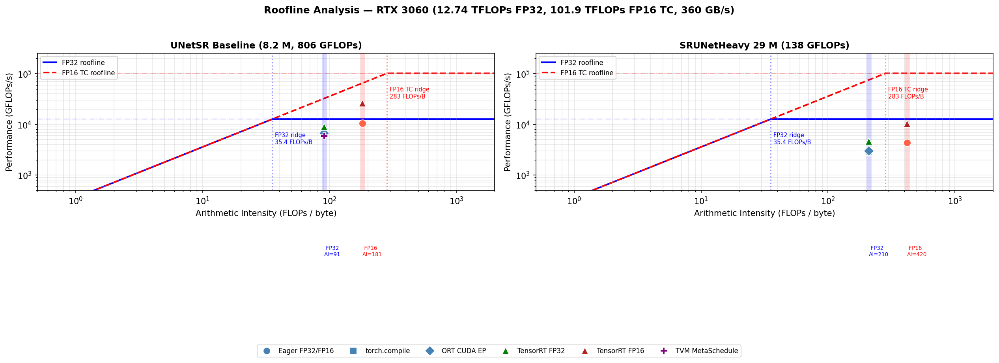

# EFML UNet — Super-Resolution Benchmarks

## Setup

```bash
source .venv/bin/activate

# TensorRT: libs live inside the venv, not on system PATH
export LD_LIBRARY_PATH="$VIRTUAL_ENV/lib/python3.12/site-packages/tensorrt_libs:$LD_LIBRARY_PATH"

# Run benchmark (baseline, all backends except TVM)
python run_all_benchmarks.py --checkpoint ../unet_sr_x4_baseline.pt --scale 4 --fp16 --no-tvm
```

### Claude Code — bypass permissions

Place in `efml-unet/.claude/settings.local.json` (Claude Code reads from the project directory):
```json
{ "bypassPermissions": true }
```
The file at `efml/.claude/settings.local.json` is only picked up when Claude Code is started from the `efml/` parent, not from `efml-unet/`.

---

## Models

### Baseline — UNetSR (`src/modeling.py`)

Checkpoint: `../unet_sr_x4_baseline.pt` · **8.2 M params** · scale ×4 · **806 GFLOPs**

```
input_proj (Conv3×3)
  │
  enc1 (Conv3×3 + LeakyReLU + 2×ResBlock) ──MaxPool──►
  enc2 (Conv3×3 + LeakyReLU + 2×ResBlock) ──MaxPool──►
  bottleneck (Conv3×3 + LeakyReLU + 4×ResBlock)
  │
  dec2 (Bilinear↑ + Conv3×3 + cat(skip) + 2×ResBlock)
  dec1 (Bilinear↑ + Conv3×3 + cat(skip) + 2×ResBlock)
  │
  lr_refinement   (4×ResBlock @ 256²)
  upsampling_head (2× [Conv3×3 → PixelShuffle(2) → LeakyReLU → ResBlock])
  reconstruction  (2×ResBlock + Conv3×3 @ 1024²)
  │
  + bicubic residual
```

**ResBlock** — pre-activation: Conv3×3 → LeakyReLU(0.2) → Conv3×3 + skip. `conv2` init to zero (identity start).

### Heavy — SRUNetHeavy (`src/heavy_modeling.py`)

Checkpoint: `../heavy_srunet_29M.pt` · **29.2 M params** · **138 GFLOPs** · input/output **256×256**

```
stem (Conv3×3 → GroupNorm → GELU)
  │
  inc  (MBResBlock  bc → bc)
  down1–4 (MaxPool2×2 → MBResBlock)    bc → 2bc → 4bc → 8bc → 8bc
  │
  bottleneck (MBResBlock + SEBlock)
  │
  up1–4 (Bilinear×2 → cat(skip) → MBResBlock)
  │
  head (Conv1×1)
  + global residual
```

**MBResBlock** (inverted residual): GroupNorm+GELU+Conv1×1(expand×4) → GroupNorm+GELU+DWConv3×3 → Conv1×1+GroupNorm(project) + skip. All `bias=False`.

**SEBlock**: AdaptiveAvgPool → Linear(C→C//4) → ReLU → Linear(C//4→C) → Sigmoid.

Channels (`bc=96`): 96 → 192 → 384 → 768 → 768, mirror in decoder.

---

## Benchmark Results

Full tables and roofline data: [`results/comparison_table.md`](results/comparison_table.md)

### UNetSR Baseline — LR 256² → HR 1024², BS=1, RTX 3060

| Method | Precision | Latency | Throughput | vs FP32 |
|---|---|---:|---:|---:|
| Eager PyTorch | FP32 | 119.7 ms | 8.4 img/s | ×1.00 |
| Eager PyTorch | FP16 | 76.1 ms | 13.1 img/s | ×1.57 |
| `torch.compile` (max-autotune) | FP32 | 109.2 ms | 9.2 img/s | ×1.10 |
| ORT CUDA EP | FP32 | 120.3 ms | 8.3 img/s | ×0.99 |
| **ORT TensorRT EP** | **FP32** | **90.6 ms** | **11.0 img/s** | **×1.32** |
| **ORT TensorRT EP** | **FP16** | **30.8 ms** | **32.4 img/s** | **×3.87** |
| TVM DLight (no tuning) | FP32 | 511 ms | 2.0 img/s | ×0.23 |
| TVM MetaSchedule (2047 trials, 74.6 min) | FP32 | 136 ms | 7.3 img/s | ×0.88 |

### SRUNetHeavy 29M — LR 256² → LR 256², BS=1, RTX 3060

| Method | Precision | Latency | Throughput | vs FP32 |
|---|---|---:|---:|---:|
| Eager PyTorch | FP32 | 48.1 ms | 20.8 img/s | ×1.00 |
| Eager PyTorch | FP16 | 31.7 ms | 31.6 img/s | ×1.52 |
| `torch.compile` (max-autotune) | FP32 | 46.6 ms | 21.5 img/s | ×1.03 |
| ORT CUDA EP | FP32 | 46.1 ms | 21.6 img/s | ×1.04 |
| **ORT TensorRT EP** | **FP32** | **29.8 ms** | **33.6 img/s** | **×1.61** |
| **ORT TensorRT EP** | **FP16** | **13.3 ms** | **75.2 img/s** | **×3.62** |

---

## Roofline Analysis



Script: `python scripts/plot_roofline.py`

**RTX 3060:** 12.74 TFLOPs FP32 · 101.9 TFLOPs FP16 TC · 360 GB/s DRAM

| Model | AI FP32 | AI FP16 | Regime FP32 | Regime FP16 TC |
|---|---:|---:|---|---|
| UNetSR Baseline | 91 FLOPs/B | 181 FLOPs/B | compute-bound | **memory-bound** (AI < 283 ridge) |
| SRUNetHeavy 29M | 210 FLOPs/B | 420 FLOPs/B | compute-bound | **compute-bound** (AI > 283 ridge) |

---

## Discussion

### UNetSR Baseline — standard 3×3 convs, PixelShuffle SR

The model's 806 GFLOPs come primarily from the **reconstruction block at 1024×1024** (2 ResBlocks + Conv3×3 at HR resolution) and the upsampling head. With AI=91 FLOPs/byte, the model is well past the FP32 memory-bandwidth ridge (35.4), meaning compute is the bottleneck. cuDNN's hand-tuned GEMM kernels for standard 3×3 convolutions exploit this: **eager PyTorch already reaches 53% of FP32 peak**.

`torch.compile` (Triton/Inductor) delivers a genuine **+10% over eager** (109 ms vs 120 ms) by fusing pointwise operators and finding better tile sizes for specific spatial shapes. Earlier measurements showed 237 ms — those were contaminated by JIT compilation time: Triton compiles on the first forward pass, which can take 5–10 s; with only 10 warmup iterations at 120 ms each, compilation can spill into the measured window.

ORT CUDA EP matches eager (×0.99) — it routes through the same cuDNN kernels without additional fusion.

TensorRT FP32 (**×1.32**, 90 ms) applies per-layer cuDNN algorithm selection and fuses conv+bias+activation into single kernels, reaching **70% of FP32 peak**. TensorRT FP16 (**×3.87**, 31 ms) adds tensor cores and halves the DRAM traffic. The FP16 AI (181 FLOPs/byte) is below the TC ridge (283), so the model is still memory-bandwidth-limited relative to TC and achieves only 26% of TC peak — headroom exists but is structurally limited by the spatial 3×3 convolutions.

TVM MetaSchedule searches for CUDA tiling schedules without cuDNN. With 2047 trials (evolutionary, 74.6 min), it reaches **136 ms (×0.88)** — close to cuDNN but not yet at parity. Two workloads produced OOB crashes (64ch 3×3 at 1024² and 256²); these were patched by substituting validated schedules from the 1024-trial replay-func run.

### SRUNetHeavy 29M — MBResBlock (DWConv + 1×1), all at LR resolution

Despite having 3.5× more parameters, the heavy model is **2.5× faster** than the baseline in FP32 (48 ms vs 120 ms). The reason: MBResBlock replaces 3×3 full convolutions with depthwise 3×3 + 1×1 pointwise, reducing FLOPs by ~7× (138 vs 806 GFLOPs). The model also avoids HR-resolution computation entirely — head outputs 256×256, not 1024×1024.

The parameter count inflates to 29 M because the expand+project 1×1 convolutions store large `C×(4C)` weight matrices, a known trade-off in MobileNet-family architectures.

Despite high AI (210 FLOPs/byte in FP32), the heavy model achieves only **22% of FP32 peak**. The reason is architectural: depthwise 3×3 convolutions process each input channel independently. This prevents the SM warp scheduler from batching work across channels, leading to low occupancy. DWConv cannot use tensor cores either (TC requires contiguous matrix multiplications with M, N, K ≥ 16). As a result, the **FP16 speedup is purely bandwidth-driven (×1.52)**, not TC-driven, and FP16 only reaches 4.3% of the TC peak.

TensorRT gains more on the heavy model than on the baseline. FP32 (**×1.61**): fusion of GroupNorm+GELU+Conv1×1 sequences into single TRT plugins reduces kernel-launch overhead, which matters more for the many shallow 1×1 layers than for deep 3×3 layers. FP16 (**×3.62**): the 1×1 pointwise convolutions are equivalent to GEMMs and do benefit from TC, partially compensating for DWConv's TC-incompatibility.

`torch.compile` and ORT give ≤×1.04 on the heavy model: Triton and ORT currently lack fused kernels for GroupNorm+GELU+DWConv sequences that TRT encodes via custom plugins.

The most effective optimisation for this architecture is **structural pruning of `mid_ch`** (Andrey's result): removing 75% of expand-channel capacity reduces DWConv iterations and restores SM occupancy, yielding **×2.27** at negligible quality cost (SSIM −0.009 after finetune, 29 M → 8.4 M params). Combining 75% pruning with TensorRT FP16 would likely push latency below 6 ms.

---

## TVM Tuning Log

| Run | Strategy | Trials | Time | Latency | vs eager |
|---|---|---:|---:|---:|---:|
| DLight (default) | — | 0 | — | 511 ms | ×0.23 |
| Run 2 | replay-func | 512 | 37.5 min | 205 ms | ×0.58 |
| Run 3 | replay-func | 1024 | 72 min | 152 ms | ×0.79 |
| Run 4 | evolutionary | 2047 | 74.6 min | 136 ms | ×0.88 |

Run 4: evolutionary strategy found better schedules for most tasks but introduced OOB crashes in 2 large-spatial workloads (64ch 3×3 at 1024² and 256²). Fixed by substituting validated run-3 schedules for those 2 workloads. Final DB: 3136 records, 27 workloads, verified clean.

```bash
# Validate database for OOB bugs
python scripts/validate_tvm_db.py

# Benchmark tuned model
python scripts/benchmark_tvm.py --mode tuned
```

---

## Andrey — Acceleration Experiments (SRUNetHeavy)

Model: `../heavy_srunet_29M.pt` (29 M params). Latency: 20 warmup + 200 timed CUDA-Event runs.

### 1. Global magnitude pruning

`torch.nn.utils.prune.global_unstructured` across all 1×1 Conv2d — tensors stay dense, no speedup. SSIM 0.7689 → 0.67 at 100%.

### 2. Structural expand-channel pruning (best result)

Removes lowest-L1-norm output channels from expand 1×1 in each MBResBlock; `mid_ch` rounded to `num_groups` multiple.

| Prune | Speedup BS=1 | Speedup BS=32 | SSIM (ft) | Drop |
|---:|---:|---:|---:|---:|
| 25% | 1.23× | 1.23× | 0.7598 | −0.009 |
| 50% | 1.57× | 1.68× | — | — |
| 75% | **2.27×** | **2.53×** | **0.7598** | **−0.009** |

75% prune + 10-epoch finetune: **2.27× speedup**, 29.3 M → 8.4 M params.

### 3. Grouped 1×1 convolutions

G=2 expand: ×1.03 speedup, −0.016 SSIM. G=4 both: ×1.13, −0.035. Worse tradeoff than structural pruning.

### 4. 2:4 semi-structured sparsity (A100 only)

`to_sparse_semi_structured` via `F.linear`. Requires sm_80+, FP16/BF16. RTX 8000 (sm_75) → fallback.  
A100 BS=1: 26 ms baseline → 31 ms sparse (0.84×). No speedup — matrices too small for cuSPARSELt amortisation.
